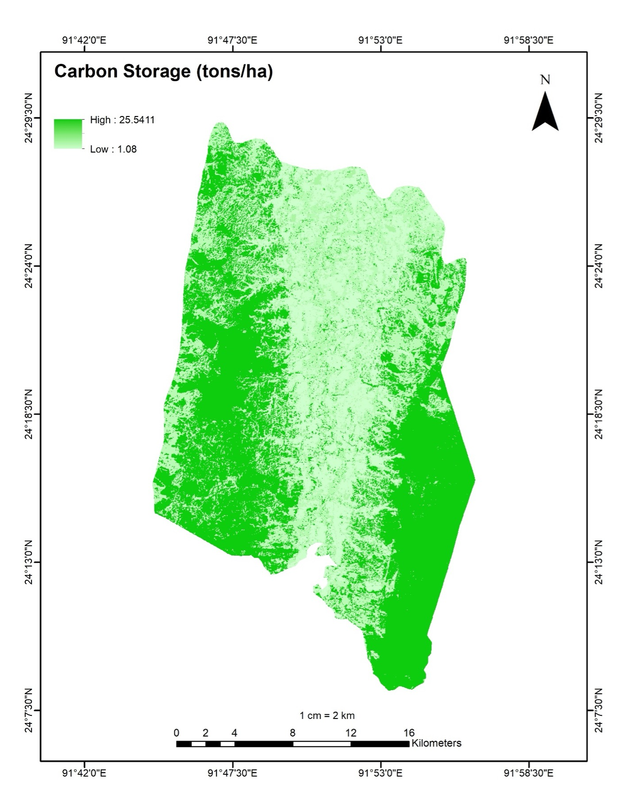

# Masters-Thesis-GIS-RemoteSensing-Portfolio
Geospatial analysis of carbon storage and LULC dynamics in Kamalganj, Bangladesh, utilizing InVEST modeling and Landsat 9 Remote Sensing for REDD+ readiness.

### 1. Land Use Land Cover (LULC) Map 2024
 

### 2. Carbon Storage Hotspots

### 3. Biophysical Data
*   **[Biophysical Table](./Biophysical_Table.xlsx)**: Input coefficients for all four carbon pools.
